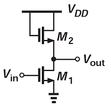
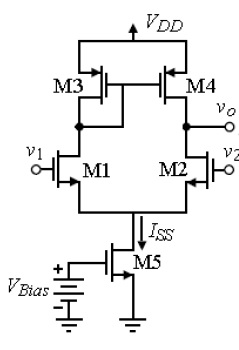

# Single-Stage and Differential Amplifiers: Design and Analysis

This repository contains the design, analysis, and simulation of single-stage amplifiers and a differential amplifier. The project explores the common source amplifier with different loads and the 5-transistor differential amplifier, highlighting their advantages, limitations, and performance in various conditions.

## Table of Contents

1. [Introduction](#introduction)
2. [Common Source Amplifier](#common-source-amplifier)
    - [With Resistive Load](#with-resistive-load)
    - [With Diode-Connected Load](#with-diode-connected-load)
3. [Differential Amplifier](#differential-amplifier)
    - [5-Transistor Differential Amplifier](#5-transistor-differential-amplifier)
4. [Simulations and Results](#simulations-and-results)
    - [Gain Analysis](#gain-analysis)
    - [Output Resistance](#output-resistance)
    - [PVT Corner Analysis](#pvt-corner-analysis)
5. [Observations and Conclusions](#observations-and-conclusions)

## Introduction

This project focuses on the design and simulation of analog amplifier circuits. The analysis begins with a single-stage common source amplifier with two different loads:

1. **Resistive Load**: Simple configuration, but highly sensitive to temperature variations.
2. **Diode-Connected Load**: Improves temperature stability.

The study culminates with the design of a **5-transistor differential amplifier**, widely used in operational amplifiers and analog signal processing.

## Common Source Amplifier

### With Resistive Load

#### Circuit Description
- Basic configuration with a resistor in the drain.
- Output voltage swing depends on the resistor value and supply voltage.
- High gain but significant temperature dependency.

#### Advantages
- Simple design.
- High voltage gain in ideal conditions.

#### Disadvantages
- Poor temperature stability.
- Output resistance limits performance.

***Explaination:** 
This represents the simplest single-stage amplifier, where the voltage gain is determined by the drain resistance connected in the circuit. However, this design presents two significant drawbacks. Firstly, achieving higher gain requires an increase in the drain resistance (Rd), which is limited by area and power constraints. Secondly, the drain resistance is temperature-dependent, causing the voltage gain to vary with temperature, thereby introducing instability in the performance.*

|  | 
| :---: | 
| Fig 1: Common Source Amplifier with resistive load |

### With Diode-Connected Load

#### Circuit Description
- Replaces the resistive load with a diode-connected MOSFET.
- Provides better temperature stability.
- Lower output voltage swing compared to the resistive load.

#### Advantages
- Improved temperature stability.
- Better linearity in the active region.

#### Disadvantages
- Reduced voltage gain.
- Lower output swing.

***Explaination:** The limitations observed in the earlier design of a common-source amplifier with a resistive load have been addressed by incorporating a diode-connected MOSFET as the active load. This adjustment enhances the temperature stability of the voltage gain and mitigates the issue of area consumption. However, this improvement comes at the cost of reduced gain, attributed to the low output resistance of the diode-connected MOSFET.*

|  | 
| :---: | 
| Fig 2: Common Source Amplifier with diode connected load |

---

## Differential Amplifier

### 5-Transistor Differential Amplifier

#### Circuit Description
- A symmetrical configuration with two input transistors, a current mirror, and a tail current source.
- Provides high common-mode rejection ratio (CMRR).
- Used for differential signal amplification.

#### Advantages
- High CMRR.
- Good linearity.
- Robust against supply and process variations.

#### Disadvantages
- Increased complexity.
- Requires careful matching of transistors.

***Explaination:** Differential amplifiers are preferred over single-stage amplifiers due to their superior performance in rejecting common-mode signals, such as noise or interference, while amplifying the differential signal of interest. This makes them ideal for applications requiring high precision and robustness in noisy environments. In our 5-transistor differential amplifier, current mirrors serve as an active load and biasing circuit. They enhance the circuit's performance by providing high output impedance, enabling improved gain, and maintaining a constant current for proper operation. This ensures stable and efficient functioning of the differential pair, while also reducing the overall power consumption and chip area.*

|  | 
| :---: | 
| Fig 3: Differential Amplifier (5-Transistor) |

## Simulations and Results

### Gain Analysis
- The gain of each configuration was analyzed both in magnitude and in decibels (dB).
- For the resistive load, the gain was higher but temperature-dependent.
- For the diode-connected load, the gain was reduced but more stable across temperature variations.
- The differential amplifier showed consistent gain due to its symmetrical structure and biasing.

### Output Resistance
- Output resistance was calculated for each amplifier configuration.
- The resistive load exhibited a predictable output resistance based on the resistor value.
- The diode-connected load reduced output resistance, improving stability but limiting swing.
- The differential amplifier achieved optimal output resistance due to its current mirror and tail current source.

### PVT Corner Analysis
- Process, Voltage, and Temperature (PVT) corner analysis was conducted to evaluate performance robustness.
- The common source amplifier with a resistive load showed significant variations in gain across PVT corners.
- The diode-connected load improved stability but showed limited performance at low supply voltages.
- The differential amplifier exhibited the best robustness across PVT corners, maintaining gain and stability.

## Observations and Conclusions

1. **Common Source Amplifier**:
    - The resistive load provides higher gain but suffers from temperature instability.
    - The diode-connected load improves temperature stability but at the cost of reduced gain.

2. **Differential Amplifier**:
    - Offers superior performance for differential signal processing.
    - Demonstrates high CMRR, making it ideal for precision applications.

3. **PVT Analysis**:
    - Highlights the importance of design trade-offs to ensure stable performance across varying conditions.

This project underscores the importance of design trade-offs in analog circuit design, highlighting the suitability of each configuration for specific use cases.

---
You can find the detailed **[Project Report](https://github.com/HarshitSri-Analog/Single-Stage-Differential-Amplifiers-Design-Analysis/blob/main/Amplifier_Single_DiffAmp.pdf)** here for further information and in-depth analysis.

***Feel free to explore the repository for detailed simulation files and analysis. If you find this repository helpful, please consider giving it a ⭐!***
